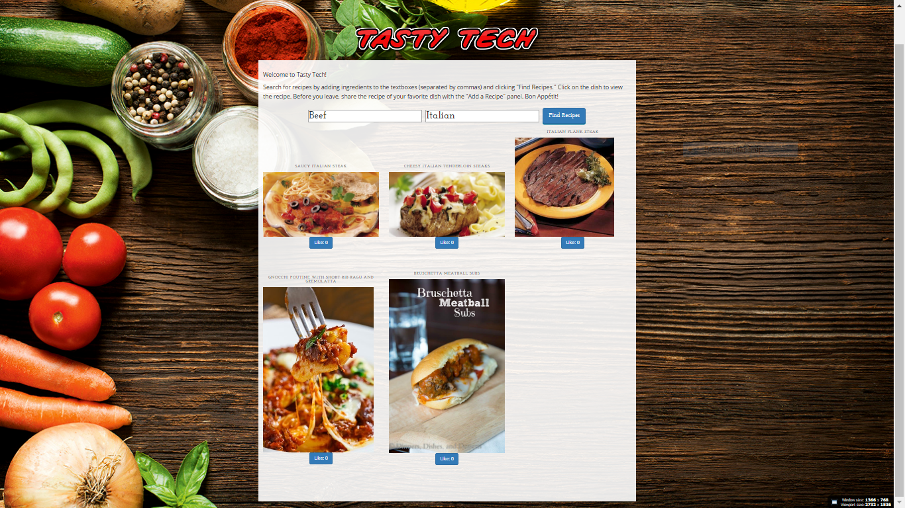

# Tasty Tech

Contributors: 
  * Jason Mosley,
  * Sung Mao (Allen) Wu,
  * Jessica Sung

## What does Tasty Tech do for you?

Don't know what to make for dinner with the ingredients you have in your fridge and pantry?
With the Tasty Tech web app you can simply tell Tasty Tech what you have and it will suggest recipes for you to try.

## How to use Tasty Tech:

Enter the ingredients you would like to use in the ingredients input field, seperated by commas, and the cuisine you would like (American, Mexican, Chinese, etc.). Then, click the "Find Recipes" button.

After clicking "Find Recipes" button, 5 recipe images will display. (Future releases will give the user the option to choose the number of recipes to display. As of 10/07/2016 only 5 will display.)

Next, click on an image to view step-by-step preparation instructions at the bottom of the page. (Future releases will display recipe in a modal.)

Users may also input their own recipes into the application's database. By clicking the "User Submitted Recipes" navigation button, the user will be directed to a page that displays recipes submitted by other users as well as an option to submit their own. (Future releases will allow users to search these recipes similar to the functionality in the "Find A Recipe" page.)

##Technologies Used in the Creation of this Project

* HTML
* CSS
* Bootstrap
* JavaScript
* jQuery
* AJAX
* Firebase
* Spoonacular API
* Slack
* Heroku
* GitHub
* Sublime Text 3
* Git Bash
* Google Fonts
* Flaming Text

#  It's what's for dinner!